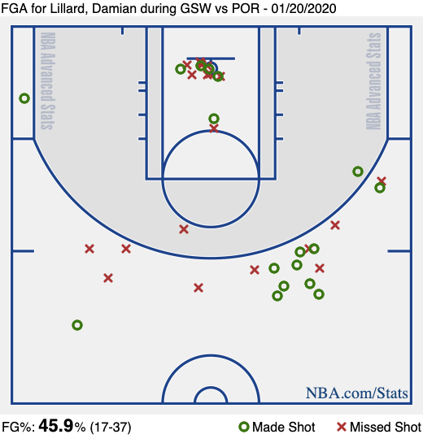

# NBA Data Ideation 
## Still looking for x,y coordinates

FGA for Lillard, Damian during GSW vs POR - 01/20/2020

I was unable to find the x,y coordinates.  This is important for me and what I am looking to do.  I reached out to the NBA advanced analytics team with this email to
see if they could provide me with the information. 

I know their x,y axis is measureed from a different place then ours is.  I have been thinking more and more about just putting my own grid over the NBA court and seeing what data prints out when I plat the points. 
If I can get this pretty accurate for one game maybe I can use computer vision in some way to teach our grid to reach where each point is some how.  

It would have to be an interactive grid that can recongize points when we overlay our matracies. This seems difficult and maybe something I can do when creating our system for the youth.  

It does not make sense to try to do all of this for this project.  I have to find another way. 

## Hwew ia the letter I sent the NBA.  I hope they get back to me soon:

Hey NBA team, 

I am looking for data for the actual x,y coordinates for a particular shot from an individual players games. I am looking for three players specifically; Steph Curry, Steve Nash, and Mark price.  In the advanced stats section they have the shot distance and the location on the court where the shot was being taken but I am looking for the actual x,y point (example: Steph Curry shoots at point 7,7 in the 4th quarter, etc.)

I am looking for this very specific data and after looking at the shot plot and the shot distance I still have not been able to locate the x,y coordinates. 

Please let me know if you could help. 

Thanks, 

Rashad

